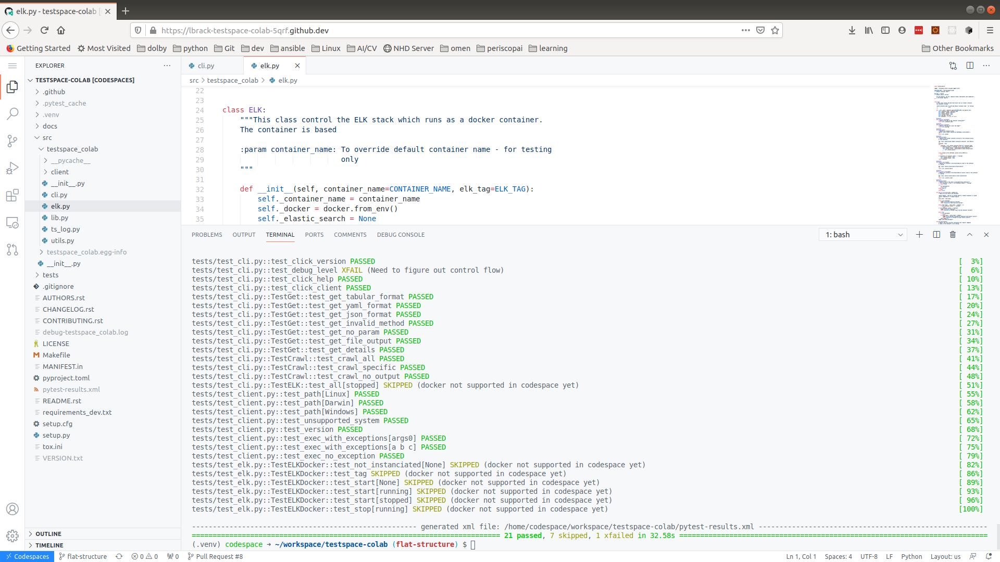

.. highlight:: shell

============
Contributing
============

Contributions are welcome, and they are greatly appreciated! Every little bit
helps, and credit will always be given.

Getting Started!
----------------

Ready to contribute? Here's how to set up `testspace_colab` for local development.

1. Clone the repository locally and create a branch::

    .. code-block:: console

        $ git clone git@github.com:lbrack/testspace-colab.git
        $ git checkout -b my_feature_branch

2. Install your local copy into a virtualenv. Note that the install
   automatically installs devpi-client and set the appropriate index
   to ``https://m.devpi.net/testspace/dev/``

    .. code-block:: console

        $ cd testspace_colab/
        $ make install

3. There is a Makefile that should be self explanatory

    .. code-block:: console

        $ make
        clean                remove all build, test, coverage and Python artifacts
        clean-build          remove build artifacts
        clean-pyc            remove Python file artifacts
        clean-test           remove test and coverage artifacts
        lint                 check style with flake8
        test                 run tests quickly with the default Python
        test-all             run tests on every Python version with tox
        coverage             check code coverage quickly with the default Python
        docs                 generate Sphinx HTML documentation, including API docs
        servedocs            compile the docs watching for changes
        release              package and upload a release
        dist                 builds source and wheel package
        install              install the package to the active Python's site-packages
        pre-commit           Full monty before a commit

4. Documenting Examples

    Rather than documenting code examples in .rst files, write Jupyter notebook.
    Those should be located under the **notebooks** directory.

    When building the documentation (and if `pandoc <https://pandoc.org/installing.html>`_
    is installed), the Jupyter Notebooks will be included in the documentaton.
    Furthermore, those notebooks will also be executed as tests.

    **NOTE**: pandoc can not be installed as a python package. The easiest is to use
    HomeBrew on `Linux <https://docs.brew.sh/Homebrew-on-Linux>`_ or
    `Mac <https://docs.brew.sh/Installation>`_

5. When you're done making changes, check that your changes pass flake8 and the
   tests, including testing other Python versions with tox::

    .. code-block:: console

        $ make pre-commit

6. Commit your changes and push your branch to GitHub::

    .. code-block:: console

        $ git add .
        $ git commit -m "Your detailed description of your changes."
        $ git push origin name-of-your-bugfix-or-feature

7. Submit a pull request through the GitHub website. It is suggested to use the
   `GitHub CLI <https://github.com/cli/cli/blob/trunk/docs/install_linux.md>`_

    .. code-block:: console

        (testspace)⚡ ⇒  gh pr create

        Creating pull request for lbrack:json-data-access into main in lbrack/testspace-colab

        ? Title my awesome work
        ? Body <Received>
        ? What's next?  [Use arrows to move, type to filter]
        > Submit
          Continue in browser
          Add metadata
          Cancel

8. You can share any version by uploading it to the devpi index

    .. code-block:: console

        $ devpi login testspace
        $ devpi use dev
        $ devpi upload --with-docs

Note about versioning
---------------------

Versions are auto-computed with `setuptools-scm <https://pypi.org/project/setuptools-scm/>`_

    .. code-block:: console

        $ ts-colab --version
        ts-colab, version 0.1.dev7+g72ad489.d20210131 client 2.5.4061

where is *0.1.dev7* the base version, *g72ad489* is the most recent commit hash
and *d20210131* indicates that some files haven't been committed. When the workspace
is clean (no modified) files, the *d2021...* is removed. This is an indicator as to
whether the version can be reproduced from a commit or not.

Using CodeSpaces
----------------

Herein are the instruction to use the code in `GitHub Codespaces <https://github.com/features/codespaces>`_

Note the the container is pre-initialized according to the definition found in
[.devcontainer/devcontainer.json](.devcontainer/devcontainer.json). This container definition
automatically sets the port mapping for ELK and Jupyter.

Select the branch you want to work with

.. image:: _static/contributions/branch-selection.png

Start code spaces (make sure the branch in codespaces matches the branch you selected)

.. code-block:: console

    # active the virtual environment
    codespace ➜ ~/workspace/testspace-colab (flat-structure) $ source .venv/bin/activate
    (.venv) codespace ➜ ~/workspace/testspace-colab (flat-structure) $

    # install in dev mode
    codespace ➜ ~/workspace/testspace-colab (flat-structure) $ make install

    # run the tests
    codespace ➜ ~/workspace/testspace-colab (flat-structure) $ make tests

.. code-block:: console

    # run the tests
    codespace ➜ ~/workspace/testspace-colab (flat-structure) $ make docs

.. image:: _static/contributions/codespaces-docs.png

It is possible to start the Jupyter Lab as illustrated below

.. image:: _static/contributions/code-space-jupyter.png

Pull Request Guidelines
-----------------------

Before you submit a pull request, check that it meets these guidelines:

1. The pull request should include tests.
2. If the pull request adds functionality, the docs should be updated. Put
   your new functionality into a function with a docstring, and add the
   feature to the list in README.rst.
3. The pull request should work for Python 3.6, 3.7 and 3.8. The GitHub
   workflow associated to PR will check all that.

Tips
----

To run a subset of tests::

$ pytest tests.test_testspace_colab

Deploying
---------

A reminder for the maintainers on how to deploy.
Make sure all your changes are committed (including an entry in CHANGELOG.rst).
Then run::

$ bump2version patch # possible: major / minor / patch
$ git push
$ git push --tags

Travis will then deploy to PyPI if tests pass.

Types of Contributions
----------------------

Report Bugs
~~~~~~~~~~~

Report bugs at https://github.com/lbrack/testspace_colab/issues.

If you are reporting a bug, please include:

* Your operating system name and version.
* Any details about your local setup that might be helpful in troubleshooting.
* Detailed steps to reproduce the bug.

Fix Bugs
~~~~~~~~

Look through the GitHub issues for bugs. Anything tagged with "bug" and "help
wanted" is open to whoever wants to implement it.

Implement Features
~~~~~~~~~~~~~~~~~~

Look through the GitHub issues for features. Anything tagged with "enhancement"
and "help wanted" is open to whoever wants to implement it.

Write Documentation
~~~~~~~~~~~~~~~~~~~

testspace-colab could always use more documentation, whether as part of the
official testspace-colab docs, in docstrings, or even on the web in blog posts,
articles, and such.

Submit Feedback
~~~~~~~~~~~~~~~

The best way to send feedback is to file an issue at https://github.com/lbrack/testspace_colab/issues.

If you are proposing a feature:

* Explain in detail how it would work.
* Keep the scope as narrow as possible, to make it easier to implement.
* Remember that this is a volunteer-driven project, and that contributions
  are welcome :)
